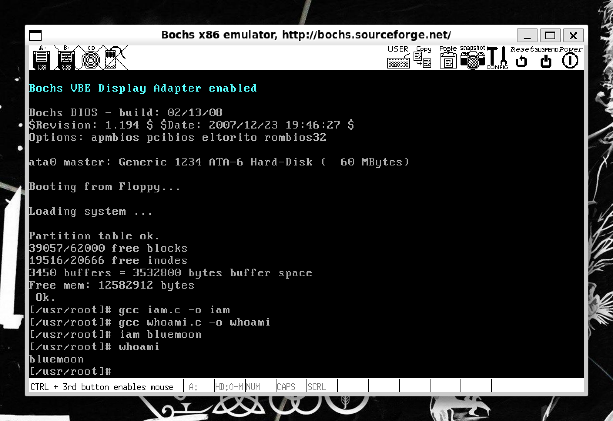
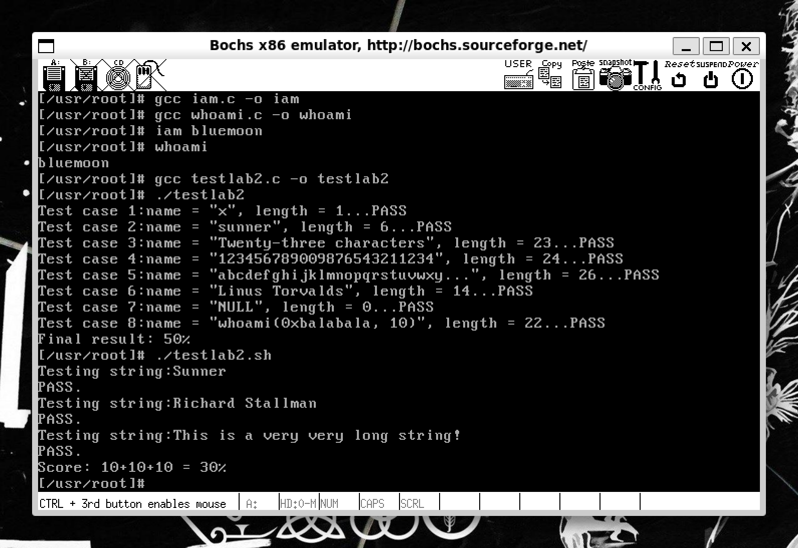

# lab2 系统调用
## 实验过程中遇见的困难
#### 挂载hdc文件夹失败
在oslab目录下执行命令：

    sudo ./mount-hdc

之后，出现如下报错：

    mount: /home/telecaster/Operating System/oslab/hdc: unknown filesystem type 'minix'.

根据报错内容，初步判断是WSL2不支持minix文件类型。于是重新编译了一个支持minix文件类型的linux内核，从而解决了这个问题。[Microsoft官方给出的Linux内核](https://github.com/microsoft/WSL2-Linux-Kernel)

#### 在修改了unistd.h文件之后系统仍然无法使用新增的系统调用
由于是在 iam.c 和 whoami.c 文件中包含了 unistd.h 这个头文件，而这个头文件并不是 linux-0.11/include/unistd.h, 而是 hdc/usr/include/unistd.h。所以应该在 hdc/usr/include/unistd.h 这个头文件中新增系统调用号。

## 实验结果截图（共计2张）
* 自行设计用例的运行结果
 
* 执行 testlab2.c 和 testlab2.sh 的得分结果

## 问题
1. 从Linux 0.11现在的机制看，它的系统调用最多能传递几个参数？你能想出办法来扩大这个限制吗？ 用文字简要描述向Linux 0.11添加一个系统调用foo()的步骤。 
答：
    * 根据 linux-0.11/include/unistd.h 中的 _syscall 一类宏定义来看，最多能传递三个参数。解决限制的方法是，将需要传递的多个参数保存在有特定结构的区间中，并将该用户态地址空间的这个区间的首地址作为一个参数传递给系统调用。最后通过寄存器间接寻址方式便可以访问所有参数。当然，这么做的话，参数合法性验证尤其必要。实际上，linux2.6内核废除了_syscall宏，而使用syscall函数，其接受一个可变参数。
    * 添加系统调用foo()的步骤： 
        1. 修改 include/linux/sys.h 在sys_call_table数组最后加入sys_foo，并仿照上面给出其他系统调用格式加上

                extern rettype sys_foo();

        2. 修改 include/unistd.h
        
                #define __NR_foo num /* num为接下来使用的系统调用号 */

        3. 修改 kernel/system_call.s

                nr_system_calls = num /* num为在原值加1 即系统调用总数目加1 */

        4. 接着在kernel中添加 foo.c ，若需要支持内核态与用户态数据交互，则包含include/asm/segment.h，其中有put_fs_XXX  get_fs_XXX函数

        5. 在 kernel/foo.c 实现系统调用 sys_foo()

        6. 最后修改kernel的Makefile，将foo.c与内核其它代码编译链接到一起

        7. 系统调用用户界面要： 

                #define __LIBRARY__
                #include <unistd.h>
                _syscallN宏展开系统调用，提供用户态的系统调用接口（参数数目确定具体宏）
        8. 挂载hdc文件夹，在 hdc/usr/include/unistd.h 这个头文件中新增系统调用号，同步骤2

